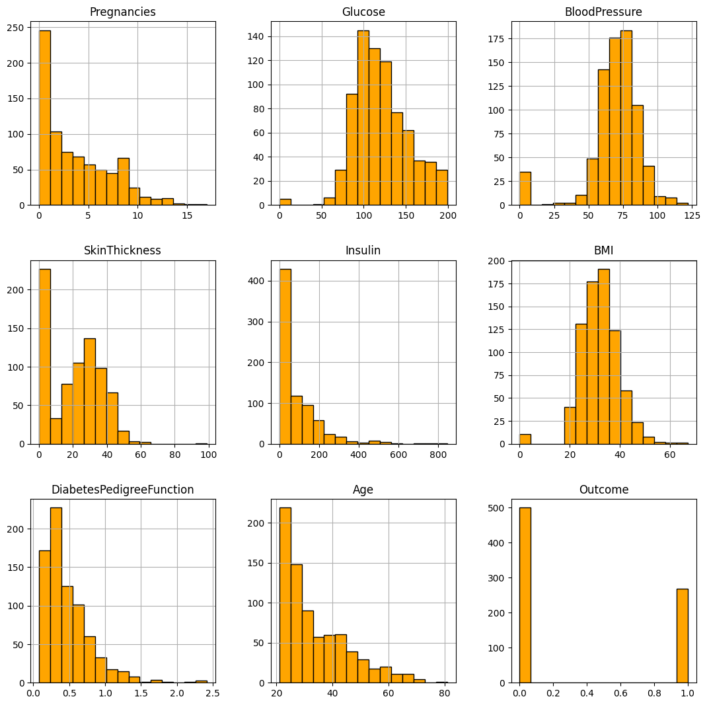
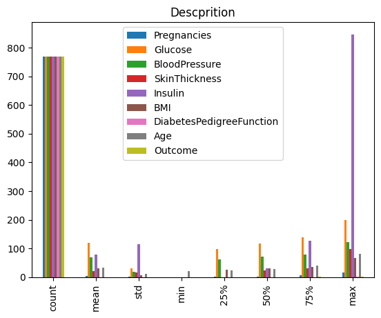
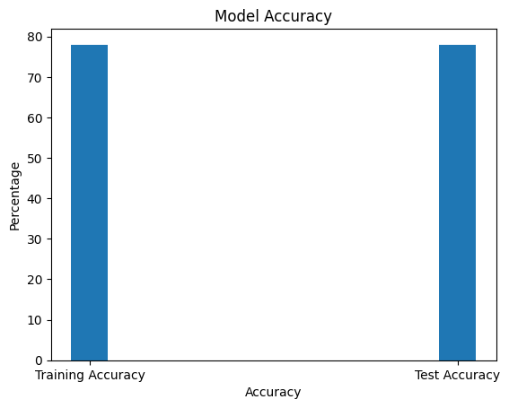

# Diabetic Prediction Machine Learning Model

This project implements a machine learning model to predict diabetes using the `svm.SVC` classifier from the scikit-learn library.

## Overview

Diabetes is a prevalent health condition affecting millions of people worldwide. Predicting the likelihood of diabetes can aid in early diagnosis and proactive management of the disease. This machine learning model aims to predict diabetes based on various health parameters.

## Libraries Used

- NumPy: For numerical computations.
- Pandas: For data manipulation and analysis.
- scikit-learn: For machine learning algorithms.
- Matplotlib: For data visualization.

## Installation

You can install the required libraries using pip:

```
!pip install numpy
!pip install pandas
!pip install scikit-learn
!pip install matplotlib
```
## Dataset

The dataset used for this project can be found [here](https://www.kaggle.com/datasets/akshaydattatraykhare/diabetes-dataset).

## Usage

1. **Importing Libraries**: Import the required libraries.

2. **Importing Dataset**: Load the dataset using Pandas.

3. **Dataset Visualization**: Visualize the dataset using histograms, bar plots, etc. *(Example: Histogram of features, class distribution)*

4. **Data Preprocessing**: Standardize the data using `StandardScaler` and split it into training and testing sets.

5. **Model Training**: Train the SVM classifier on the training data.

6. **Model Evaluation**: Evaluate the model's accuracy on both the training and testing datasets. *(Example: Accuracy scores)*

7. **Making Predictions**: Make predictions using the trained model.
   
## Kaggle Notebook

This project also includes a Kaggle notebook where you can find a detailed analysis and implementation of the diabetic prediction model. The notebook covers data exploration, preprocessing, model training, evaluation, and more.

You can access the Kaggle notebook [here](https://www.kaggle.com/saragadamsaiprasad/diabetics-prediction).


## Results

- *Histogram of Features*: 
- *Class Distribution*: 
- *Model Accuracy*: 

## Conclusion

This machine learning model demonstrates promising results in predicting diabetes based on the provided dataset. Further refinement and optimization may enhance its performance in real-world applications.

